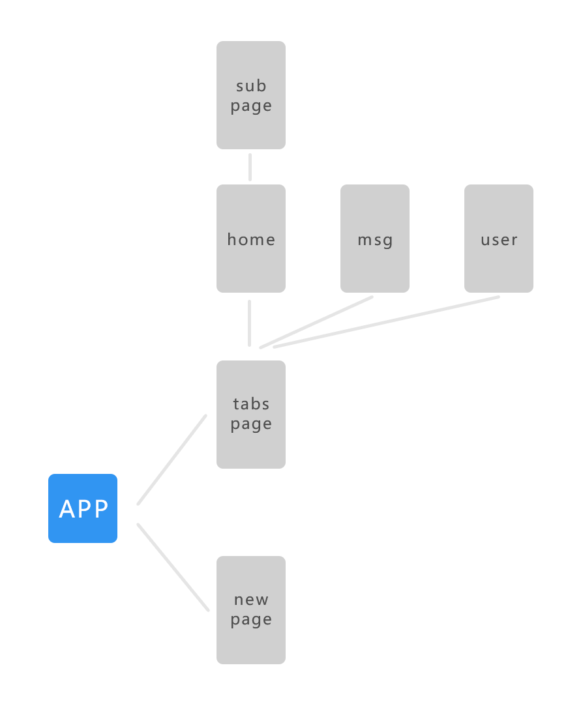

# vha-template-tabs
这是一个带有tabbar和基本页面逻辑的vue-hybrid-app模板 [gitee预览页面](https://mixingyu.gitee.io/vha-template-tabs/) [github预览页面](https://mixingyu.github.io/vha-template-tabs/)

```
npm install
npm run serve
cordova platform add android
cordova run android
```

## 路由逻辑

